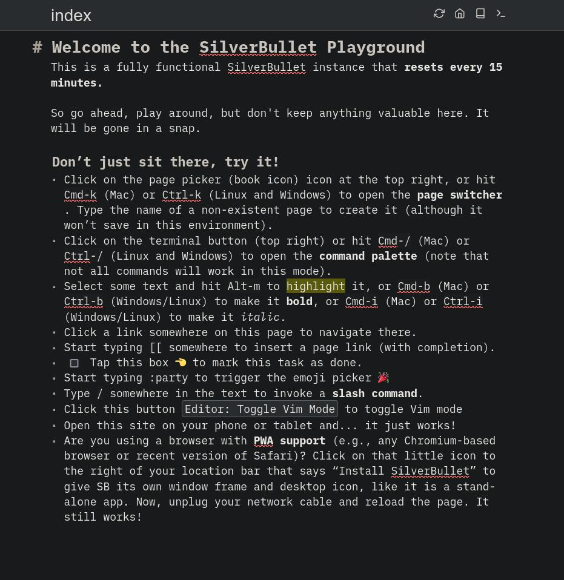

<!--
注意：此 README 由 <https://github.com/YunoHost/apps/tree/master/tools/readme_generator> 自动生成
请勿手动编辑。
-->

# YunoHost 上的 SilverBullet

[](https://ci-apps.yunohost.org/ci/apps/silverbullet/)


[](https://install-app.yunohost.org/?app=silverbullet)

*[阅读此 README 的其它语言版本。](./ALL_README.md)*

> *通过此软件包，您可以在 YunoHost 服务器上快速、简单地安装 SilverBullet。*  
> *如果您还没有 YunoHost，请参阅[指南](https://yunohost.org/install)了解如何安装它。*

## 概况

SilverBullet aims to be your workshop for the mind: a creative space where you collect, create and expand your personal knowledge, while also letting you constantly evolve the tools you use to do so.

While you can use SilverBullet as a simple note taking application that stores notes in plain markdown files on disk, it becomes truly powerful in the hands of more technical power users. By leveraging metadata annotations, its Objects infrastructure, Live Queries and Live Templates, SilverBullet becomes a powerful end-user programming tool, enabling you to quickly develop various types of ad-hoc knowledge applications.

# Features

SilverBullet...

- Runs in any modern browser (including on mobile) as a PWA in two Client Modes (_online_ and _synced_ mode), where the _synced mode_ enables **100% offline operation**, keeping a copy of content in the browser, syncing back to the server when a network connection is available.
- Provides an enjoyable markdown writing experience with a clean UI, rendering text using Live Preview, further **reducing visual noise** while still providing direct access to the underlying markdown syntax.
- Supports wiki-style **page linking** using the `[[page link]]` syntax. Incoming links are indexed and appear as “Linked Mentions” at the bottom of the pages linked to thereby providing _bi-directional linking_.
- Optimized for **keyboard-based operation**:
  - Quickly navigate between pages using the **page switcher** (triggered with `Cmd-k` on Mac or `Ctrl-k` on Linux and Windows).
  - Run commands via their keyboard shortcuts or the **command palette** (triggered with `Cmd-/` or `Ctrl-/` on Linux and Windows).
  - Use Slash Commands to perform common text editing operations.
- Provides a platform for [end-user programming](https://www.inkandswitch.com/end-user-programming/) through its support for Objects, Live Queries and Live Templates.
- Robust extension mechanism using plugs.
- **Self-hosted**: you own your data. All content is stored as plain files in a folder on disk. Back up, sync, edit, publish, script with any additional tools you like.
- SilverBullet is [open source, MIT licensed](https://github.com/silverbulletmd/silverbullet) software.


**分发版本：** 0.10.1~ynh1

**演示：** <https://play.silverbullet.md/>

## 截图



## 文档与资源

- 官方应用网站： <https://silverbullet.md>
- 上游应用代码库： <https://github.com/silverbulletmd/silverbullet>
- YunoHost 商店： <https://apps.yunohost.org/app/silverbullet>
- 报告 bug： <https://github.com/YunoHost-Apps/silverbullet_ynh/issues>

## 开发者信息

请向 [`testing` 分支](https://github.com/YunoHost-Apps/silverbullet_ynh/tree/testing) 发送拉取请求。

如要尝试 `testing` 分支，请这样操作：

```bash
sudo yunohost app install https://github.com/YunoHost-Apps/silverbullet_ynh/tree/testing --debug
或
sudo yunohost app upgrade silverbullet -u https://github.com/YunoHost-Apps/silverbullet_ynh/tree/testing --debug
```

**有关应用打包的更多信息：** <https://yunohost.org/packaging_apps>
